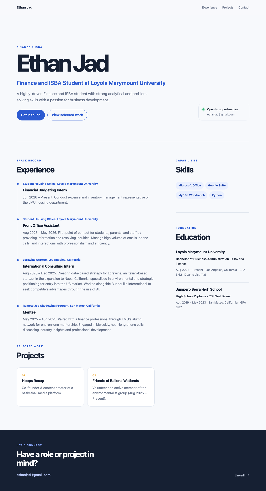

# Exercise 03 Evidence

## 1. VM details

| Field | Value |
|---|---|
| VM name | `vm-career-platform` |
| Resource group | `rg-career-platform` |
| Region | `swedencentral` (Sweden Central) |
| Size | `Standard_B2ats_v2` (2 vCPU, 1 GiB) |
| Public IP address | `135.225.24.52` |

Source: `az vm show -d -g rg-career-platform -n vm-career-platform` (VM state: `VM running`).

## 2. Site screenshot

The site at `http://135.225.24.52:8000/`, captured 2026-09-30 17:22 PDT, during the two-lock step (section 6 of the guide) while the NSG rule `Temp-HTTP-8000` (priority 310, TCP 8000 from `*`) was open. The page returned HTTP `200`.

## 3. Troubleshooting

One area that required a fair amount of troubleshooting was when I was trying to set up my Virtual Machine. It was challenging to find a size, region, and price that all aligned with my desires. When I initially prompted claude to find a solution, I simply wanted it to provide me with options and allow me to select from the presented options. However, claude automatically created and started running the virtual machine without waiting for my approval. This is why my region is based in Sweden. While this is not ideal because of slower response times and a slight price increase, I opted to keep this due to functionality. At first, I was confused as to why I could not change my location to U.S Central-- but after discovering that a VM had already been running, I ultimately decided to keep my VM as is.

## 4. The Change

In the coffee shop situation, I would not be able to SSH into my VM because there is a firewall and a rule. The firewall and rule only allows SSH from my IP address at LMU, and the WiFi at the coffee shop blocks the SSH usage port 22. In this scenario, I would likely add the coffee shop’s IP address as a rule to my firewall for temporary access. However, I would need to remove this rule once I return to LMU. I could also run SSH on a port that the coffee shop WiFi is compliant with. Adding an extra IP rule would come at the cost of security risk because the SSH would be available to more IP addresses.
